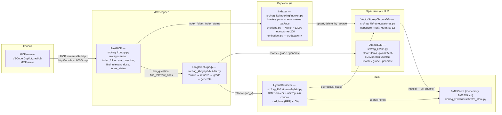
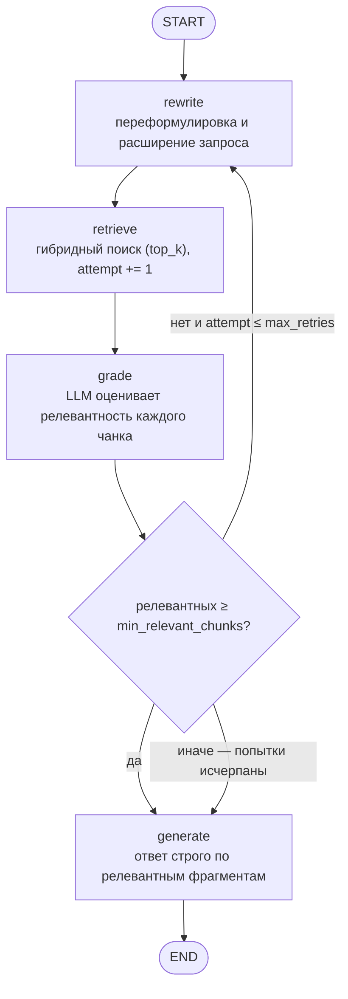

# Архитектура rag-kb

## Обзор

rag-kb — MCP-сервер «база знаний», построенный на FastMCP и LangGraph. Он индексирует локальную папку документов в персистентный ChromaDB (векторный поиск) и in-memory BM25-индекс (точный лексический поиск), а ответы на вопросы генерирует Corrective RAG-графом: запрос переформулируется, гибридный поиск выдаёт кандидатов, LLM оценивает их релевантность, и только релевантные фрагменты попадают в контекст генерации. При неуспехе поиск повторяется с расширенной формулировкой (до двух раз). Ответ всегда сопровождается списком источников.

Принцип проекта — «локально и без внешних API»: LLM (Ollama, `qwen2.5:3b`), эмбеддинги (встроенная функция ChromaDB или `nomic-embed-text` через Ollama), векторное хранилище (ChromaDB) и sparse-поиск (rank-bm25) работают на машине пользователя; ни один запрос не уходит к платным облачным сервисам, ключи API не нужны. Единственный внешний процесс — локальный сервер Ollama (в Docker-составе поднимается рядом).

## Компоненты



Модули по фактическому коду:

- `src/rag_kb/app.py` — `create_mcp_server(...)`: FastMCP и регистрация четырёх инструментов; каждый возвращает JSON. `ask_question` обслуживается `AskRunner` (фон + кеш, без клиентских таймаутов).
- `src/rag_kb/server.py` — входная точка (`python -m rag_kb.server`): сборка реальных зависимостей (Settings, VectorStore, embedder, BM25Store, HybridRetriever с `rebuild_bm25()` после рестарта, Indexer, OllamaLLM, `build_graph`), фоновый прогрев моделей Ollama (`start_warmup`) и `mcp.run(transport="streamable-http")`. Прогрев нужен, чтобы первый вопрос после старта не платил загрузку LLM с диска (минуты на CPU) и не упирался в таймауты MCP-клиентов.
- `src/rag_kb/config.py` — `Settings` (pydantic-settings, префикс `RAGKB_`, `get_settings` под `lru_cache`).
- `src/rag_kb/types.py` — датаклассы `LoadedDoc`, `Chunk`, `IndexReport`, `IndexStats`.
- `src/rag_kb/llm.py` — протокол `LLM` (`invoke(prompt, num_predict)`) и `OllamaLLM`: экземпляры `ChatOllama` кэшируются по `num_predict`; `keep_alive` удерживает модель в RAM Ollama между вызовами.
- `src/rag_kb/indexing/loaders.py` — `scan_folder` (glob-паттерн + фильтр по поддерживаемым расширениям) и `load_file` (TextLoader из LangChain, UTF-8).
- `src/rag_kb/indexing/chunking.py` — `split_document`: `RecursiveCharacterTextSplitter`; для python/js/ts/markdown — сплиттер «из языка» (границы функций/классов/заголовков), для остальных — обычный; id чанка — `sha1(source:chunk_index)`.
- `src/rag_kb/indexing/embedder.py` — протокол `Embedder`; реализации `ChromaDefaultEmbedder` (ONNX all-MiniLM-L6-v2, входит в chromadb) и `OllamaEmbedder` (nomic-embed-text); выбор через `create_embedder(settings)`.
- `src/rag_kb/indexing/indexer.py` — `Indexer.index_folder` (оркестрация, изоляция ошибок, отчёт) и `Indexer.status`.
- `src/rag_kb/retrieval/stores.py` — `VectorStore`: `chromadb.PersistentClient`, коллекция `documents` с метрикой `l2`; `upsert` с дедупликацией id внутри батча, `delete_by_source`, `all_chunks`, `last_indexed_at` в метаданных коллекции.
- `src/rag_kb/retrieval/bm25_store.py` — `BM25Store` на `BM25Okapi`; токенизация `re.findall(r"\w+", text.lower())`; in-memory, пересобирается из ChromaDB.
- `src/rag_kb/retrieval/hybrid.py` — `rrf_fuse(...)` и `HybridRetriever.search`: BM25-топ + векторный топ, слияние RRF.
- `src/rag_kb/graph/state.py` — `GraphState` (TypedDict).
- `src/rag_kb/graph/nodes.py` — промпты (`REWRITE_PROMPT`, `BATCH_GRADE_PROMPT`, `GRADE_PROMPT`, `GENERATE_PROMPT`, `NOT_FOUND_ANSWER`), фабрики узлов и парсеры ответа грейдера (`_parse_relevant_numbers` — пакетный, `_parse_relevant` — поштучный фолбэк).
- `src/rag_kb/graph/builder.py` — сборка `StateGraph` и условное ребро после `grade`.

## Потоки данных

Индексация (`index_folder`):

Индексация выполняется в фоновом потоке: `index_folder` (через `Indexer.start_indexing`) отвечает мгновенно (`started`/`already_running`), а сам конвейер ниже крутится в daemon-потоке. Причина: CPU-эмбеддинги большой папки занимают минуты, а MCP-клиенты обрывают вызов по таймауту (~60 с) и решают, что операция не удалась. Прогресс («3/17») и итог последнего запуска (`last_report`) видны через `index_status`.

1. `scan_folder` — glob по паттерну, фильтр расширений `.md .txt .py .js .ts .json .yaml`, сортировка.
2. `load_file` — чтение файла как UTF-8 текста.
3. `split_document` — чанки ~1200 символов с перекрытием 200; сплиттер выбирается по типу документа (для кода и markdown — с учётом синтаксиса языка); метаданные: `source`, `chunk_index`, `total_chunks`, `doc_type`.
4. `embedder.embed_documents` — векторы для всех чанков файла.
5. Атомарная замена по source: `vector_store.delete_by_source(path)`, затем `add_chunks` (upsert) — в индексе не остаётся старых чанков переиндексированного файла.
6. Битый файл (не читается, неподдерживаемая кодировка и т. п.) не роняет индексацию: исключение перехватывается, путь и причина попадают в `errors` отчёта.
7. После всех файлов — `bm25.build(vector_store.all_chunks())`: BM25 перестраивается целиком из ChromaDB.
8. `set_last_indexed_at(now UTC, ISO)` — в метаданные коллекции; `IndexReport` возвращает files/chunks/seconds/errors.

Вопрос (`ask_question`):

Инструмент не падает клиентскими таймаутами: граф исполняется в фоновом потоке (`AskRunner`, src/rag_kb/ask_runner.py), а вызов ждёт до `ask_wait_seconds` (25 c — меньше типовых клиентских таймаутов). Успел — клиент получает готовый ответ; не успел — `status="in_progress"` с `retry_after_seconds` (30 c) и подсказкой повторить тот же вопрос (повтор отдаёт результат из кеша мгновенно). Ошибки графа перехватываются и возвращаются как `status="error"` с текстом, а не MCP-ошибкой. Ответы последних `ask_cache_size` вопросов кешируются.

1. `rewrite` — первая попытка: `query = question`; при повторных — LLM переформулирует и расширяет запрос (синонимы, связанные термины).
2. `retrieve` — `HybridRetriever.search(query)` (top_k=6); `attempt += 1` (инкремент только здесь).
3. `grade` — поштучный грейдинг (по умолчанию, `grade_mode="per_chunk"`): LLM оценивает каждый чанк отдельным вызовом (`GRADE_PROMPT` + `_parse_relevant`); строгие вердикты при пустом результате запускают корректирующий retry-цикл. Режим `grade_mode="batch"` — все top-k фрагментов одним вызовом (`BATCH_GRADE_PROMPT`, `_parse_relevant_numbers`; быстрее, но оптимистичнее — пропускает мусор в генерацию и мешает retry). Инференс детерминирован: `temperature=0`.
4. Маршрутизатор: релевантных достаточно — `generate`; нет и попытки не исчерпаны — назад в `rewrite`; иначе `generate` с пустым `relevant`.
5. `generate` — ответ строго по релевантным фрагментам («не выдумывай; если ответа нет — так и скажи»); `sources` — уникальные `source` релевантных чанков. При пустом `relevant` — фиксированный `NOT_FOUND_ANSWER` и пустые источники.

`find_relevant_docs` идёт напрямую в `HybridRetriever.search` без LLM-генерации.

## Гибридный поиск и RRF

Слияние двух ранжированных списков (BM25 и векторного) — Reciprocal Rank Fusion:

```text
score(d) = Σ_i  1 / (k + rank_i(d)),   k = 60 (RAGKB_RRF_K)
```

где `rank_i(d)` — позиция чанка `d` в списке `i` (нумерация с 1). Чанк, попавший только в один список, получает вклад только из него; итоговый порядок — по убыванию суммы, сверху обрезается до `top_k`.

Зачем два списка: BM25 силён на точных терминах — имена собственные («Магнус Чёрный Молот»), числа и диапазоны («40-63», «12 408», «14 октября 903»), идентификаторы; векторный поиск — на смысле и парафразе, когда формулировка вопроса не совпадает со словами документа. RRF объединяет их без необходимости приводить несравнимые шкалы счётчиков BM25 и расстояний L2 к общему знаменателю.

Почему свой `rrf_fuse`, а не `EnsembleRetriever` из LangChain: функция в 14 строк на наших `Chunk`-объектах — явная, детерминированная и напрямую тестируемая (`tests/unit/test_rrf.py`), параметр `k` под нашим контролем (конфигурируется через `RAGKB_RRF_K`), и она не тянет за собой LCEL-композицию ретриверов с их собственной логикой весов и дедупликации.

## LangGraph-граф



`GraphState` (`graph/state.py`):

| Поле | Смысл |
| --- | --- |
| `question` | исходный вопрос пользователя |
| `query` | текущий (пере)сформулированный поисковый запрос |
| `attempt` | номер попытки поиска (0 — до первого retrieve) |
| `chunks` | чанки после retrieve |
| `relevant` | чанки, оценённые LLM как релевантные |
| `answer` | итоговый ответ |
| `sources` | уникальные source релевантных чанков |

Условный маршрутизатор после `grade` (`builder.py`, `_route_after_grade`):

- `len(relevant) >= min_relevant_chunks` (по умолчанию 1) — в `generate`;
- иначе если `attempt <= max_retries` (по умолчанию 2) — в `rewrite` (новая попытка с расширенным запросом);
- иначе — в `generate` (пустой `relevant` даёт `NOT_FOUND_ANSWER`).

Гарантия завершимости: `attempt` пишется только в узле `retrieve` и только увеличивается, а порог `max_retries` фиксирован, поэтому цикл `rewrite → retrieve → grade` ограничен `1 + max_retries` проходами поиска (не более трёх при дефолтах), после чего граф гарантированно уходит в `generate` и `END`.

## Ключевые решения и компромиссы

- **ChromaDB — единственный источник правды.** Персистентная коллекция переживает рестарты; BM25 живёт в памяти и перестраивается из ChromaDB целиком — после индексации (`indexer.py`, шаг 7 схемы выше) и при старте сервера (`server.py` → `retriever.rebuild_bm25()`). Цена: на больших индексах полный rebuild дороже инкрементального обновления; выгода: in-memory копия не может разойтись с хранилищем.
- **Эмбеддинги считаются снаружи и передаются в коллекцию.** `VectorStore.add_chunks(chunks, embeddings)` принимает готовые векторы, а коллекция создаётся без собственной embedding-функции. Поэтому провайдер эмбеддингов — `chromadb` (ONNX MiniLM, работает без Ollama) или `ollama` (`nomic-embed-text`) — переключается одной переменной `RAGKB_EMBEDDING_PROVIDER`, и `VectorStore` вообще не знает о модели.
- **Грейдер под маленькую модель.** Порядок частей промпта критичен для 3B-модели: фрагмент текста — в начале, вопрос — в конце, ближе к точке ответа; так `qwen2.5:3b` надёжно сопоставляет их (при обратном порядке модель ошибочно отклоняла заведомо релевантные фрагменты — см. REPORT.md, п. 13). Промпт выбирали из 7 опробованных вариантов; финальная формулировка прошла проверку 20/20. Тот же принцип сохранён в пакетном промпте: пронумерованные фрагменты — в начале, вопрос и инструкция — в конце. Парсер `_parse_relevant` терпим к формату: JSON `{"relevant": ...}` (bool либо строка, начинающаяся с `y`/`д`), а вне JSON — регистронезависимое отдельное слово `yes`.
- **Режим грейдинга выбирается конфигом.** Поштучный (`per_chunk`, по умолчанию) — по вызову LLM на чанк: строже, чаще отклоняет мусор, и именно его «пустой» вердикт запускает корректирующий retry-цикл Corrective RAG; медленнее (top-k вызовов), но бюджет AskRunner (25 c до отдачи in_progress с последующим переспросом) это покрывает. Пакетный (`batch`) — один вызов на все чанки («перечисли номера релевантных»): быстрее, но на 3B-модели оптимистичен — пропускает слаборелевантные фрагменты в генерацию и подавляет retry. Выбор — `RAGKB_GRADE_MODE`; парсер пакетного ответа строг к противоречиям («нет» вместе с номерами — фолбэк на поштучный).
- **Детерминированный инференс.** `temperature=0` у всех клиентов Ollama: грейдинг и генерация воспроизводимы от запуска к запуску — без этого одни и те же вопросы давали то верный ответ, то неверный (замеры это поймали).
- **Ускорение холодного старта и генерации.** `ollama_keep_alive_sec=2592000` (RAGKB_OLLAMA_KEEP_ALIVE_SEC, 30 суток; действует и на LLM, и на эмбеддинг-модель) не даёт Ollama выгружать модели из RAM после простоя — без этого первый вопрос после 5 минут тишины платит полную загрузку модели (замер: минуты; значение в секундах, потому что строковые duration Ollama парсит строго и отвергает голое `-1`). Лимиты `num_predict` подобраны по типу вызова (грейдинг — 8/32, rewrite — 100, генерация — 300 токенов), а промпт генерации требует краткий ответ в 2–3 предложения: модель не «разгоняется» в длинные рассуждения там, где нужен короткий ответ (длина ответа на CPU линейно съедает время).
- **Метрика L2 в ChromaDB.** Оба эмбеддера выдают нормализованные векторы, а при `|x| = |y| = 1` упорядочение по евклидову расстоянию совпадает с упорядочением по косинусной близости — то есть на деле ранжирование косинусное, без специальной настройки пространства.
- **Изоляция ошибок индексации.** Каждый файл обрабатывается в своём `try/except`: один битый файл не рушит индексацию, а попадает в `errors` отчёта (и уменьшает счётчик `files`).
- **Фоновая индексация вместо синхронного вызова.** `index_folder` запускает конвейер в daemon-потоке (`Indexer.start_indexing`: флаг под `threading.Lock`, повторный вызов возвращает `already_running`) и отвечает мгновенно, а прогресс и итог отдаются через `index_status` (`indexing_in_progress`, `progress`, `last_report`). Компромисс: клиент должен поллить статус вместо одного блокирующего вызова; выгода: индексация на CPU не упирается в клиентские таймауты MCP (~60 с) и не теряется при обрыве соединения.
- **ask_question без таймаутов и без поллинга.** Тот же приём, что у индексации, но с сохранением синхронного контракта: `AskRunner` держит граф в фоне и отдаёт готовый ответ, пока клиент готов ждать (`ask_wait_seconds`, 25 c — меньше типовых клиентских таймаутов MCP); на запросы дольше — `in_progress` с `retry_after_seconds` (подождать ~30 c и переспросить) и кешем по вопросу, повторный вызов возвращает результат мгновенно. Компромисс: в редких длинных случаях клиенту нужен повторный вызов; выгода: инструмент никогда не падает ошибкой таймаута и сохраняет контракт «ответ + источники» из задания.
- **Известные ограничения.** Файлы, удалённые с диска, не вычищаются из индекса при переиндексации: `delete_by_source` вызывается только для найденных на диске файлов, «мёртвые» source остаются в коллекции (лечится очисткой каталога `RAGKB_CHROMA_DIR` и переиндексацией). CPU-инференс медленный: эмбеддинги и генерация на CPU занимают минуты.

## Конфигурация

`Settings` (`src/rag_kb/config.py`), префикс переменных окружения `RAGKB_`, лишние переменные игнорируются:

| Поле | Переменная | По умолчанию | Описание |
| --- | --- | --- | --- |
| `host` | `RAGKB_HOST` | `0.0.0.0` | Адрес MCP-сервера |
| `port` | `RAGKB_PORT` | `8000` | Порт MCP-сервера (endpoint `/mcp`) |
| `chroma_dir` | `RAGKB_CHROMA_DIR` | `data/chroma` | Каталог персистентного ChromaDB |
| `collection_name` | `RAGKB_COLLECTION_NAME` | `documents` | Имя коллекции ChromaDB |
| `ollama_base_url` | `RAGKB_OLLAMA_BASE_URL` | `http://localhost:11434` | Адрес Ollama |
| `llm_model` | `RAGKB_LLM_MODEL` | `qwen2.5:3b` | Модель LLM |
| `ollama_keep_alive_sec` | `RAGKB_OLLAMA_KEEP_ALIVE_SEC` | `2592000` | Удержание моделей (LLM и эмбеддингов) в RAM Ollama, сек; 30 суток |
| `num_predict_batch_grade` | `RAGKB_NUM_PREDICT_BATCH_GRADE` | `32` | Лимит токенов: пакетный грейдинг |
| `num_predict_grade` | `RAGKB_NUM_PREDICT_GRADE` | `8` | Лимит токенов: поштучный грейдинг (фолбэк) |
| `num_predict_rewrite` | `RAGKB_NUM_PREDICT_REWRITE` | `100` | Лимит токенов: переформулировка запроса |
| `num_predict_generate` | `RAGKB_NUM_PREDICT_GENERATE` | `300` | Лимит токенов: генерация ответа |
| `embedding_provider` | `RAGKB_EMBEDDING_PROVIDER` | `chromadb` | Провайдер эмбеддингов: `chromadb` \| `ollama` |
| `ollama_embedding_model` | `RAGKB_OLLAMA_EMBEDDING_MODEL` | `nomic-embed-text` | Модель эмбеддингов Ollama |
| `chunk_size` | `RAGKB_CHUNK_SIZE` | `1200` | Размер чанка, символов |
| `chunk_overlap` | `RAGKB_CHUNK_OVERLAP` | `200` | Перекрытие чанков, символов |
| `grade_chunk_chars` | `RAGKB_GRADE_CHUNK_CHARS` | `1200` | Сколько символов чанка уходит в промпт грейдера (равно размеру чанка — без усечения) |
| `top_k` | `RAGKB_TOP_K` | `6` | Размер выдачи гибридного поиска |
| `rrf_k` | `RAGKB_RRF_K` | `60` | Константа k в RRF |
| `min_relevant_chunks` | `RAGKB_MIN_RELEVANT_CHUNKS` | `1` | Минимум релевантных чанков для генерации |
| `max_retries` | `RAGKB_MAX_RETRIES` | `2` | Максимум повторов поиска с расширенным запросом |
| `grade_mode` | `RAGKB_GRADE_MODE` | `per_chunk` | Грейдинг: `per_chunk` (строже) \| `batch` (быстрее) |
| `ask_wait_seconds` | `RAGKB_ASK_WAIT_SECONDS` | `25` | Сколько ask_question ждёт ответ до отдачи in_progress |
| `ask_cache_size` | `RAGKB_ASK_CACHE_SIZE` | `10` | Сколько последних вопросов кешируется в AskRunner |

В `docker-compose.yml` для сервиса `rag-kb` заданы `RAGKB_OLLAMA_BASE_URL=http://ollama:11434`, `RAGKB_EMBEDDING_PROVIDER=ollama` и модели через переменные `LLM_MODEL`/`EMBEDDING_MODEL`; в `Dockerfile` — `RAGKB_CHROMA_DIR=/data/chroma` (том `chroma_data`).

## ИИ-инструменты разработки

Проект разрабатывался в агентном цикле с использованием следующих инструментов:

- **opencode** — агентная CLI-среда, в которой велась вся разработка: чтение кода, правки, запуск тестов и git-коммиты выполнялись агентом в терминале.
- **Плагин superpowers** — набор процессов для opencode: планирование до реализации, TDD (тесты писались раньше или вместе с кодом), субагентное исполнение задач с двухступенчатым ревью.
- **MCP-сервер Context7** — подключён к агенту и давал актуальную документацию библиотек по ходу работы (FastMCP, LangGraph, ChromaDB, rank-bm25), что исключало написание кода по устаревшим сигнатурам из памяти модели.
- **Модель GLM 5.3 (z.ai)** — исполняла задачи агента: анализ требований, написание кода и тестов, отладка (включая диагностику промпта грейдера), тексты документации.

Процесс разработки: план → декомпозиция на задачи → субагент на каждую задачу. Результат работы субагента-исполнителя проходил два независимых ревью — соответствие спецификации задачи (spec review) и качество кода (quality review); в основную ветку попадали только прошедшие оба. Часть истории процесса зафиксирована в REPORT.md и GLOSSARY.md.

## Тесты

Структура (`tests/`, всего 100 тестов, сеть не нужна):

- `tests/conftest.py` — `FakeLLM` (программируемая очередь ответов с записью всех промптов) и `FakeEmbedder` (детерминированные векторы из sha1 хэша текста).
- `tests/unit/` — узлы графа и сборка (`test_nodes.py`, `test_builder.py`), RRF (`test_rrf.py`), BM25 (`test_bm25.py`), чанкинг, загрузчики, индексер, сторы, эмбеддер, конфиг, типы.
- `tests/e2e/test_mcp_tools.py` — все четыре MCP-инструмента через `fastmcp.Client`: сборка реального пайплайна с ChromaDB во временном каталоге и фейковыми LLM/эмбеддером.
- `tests/test_sample_docs.py` — 26 проверочных фактов демонстрационной базы (параметризованный тест) и гейт суммарного размера `sample_docs/` (не меньше 500 КБ).

CI (`.github/workflows/ci.yml`), GitHub Actions, два job'а:

- `lint-and-test` — `uv sync --frozen`, `ruff check .`, `ruff format --check .`, `pytest -q`;
- `docker-build` — сборка образа `docker build -t rag-kb:ci .`.
